# BitLend: Trustless BTC Lending Protocol on exSat

## Project Overview

BitLend is a permissionless lending protocol built on exSat Network that allows Bitcoin holders to collateralize their BTC to borrow stablecoins or XSAT tokens. The platform leverages exSat's UTXO data synchronization and EVM compatibility to create a seamless, trustless lending experience with transparent proof of reserves.

## Architecture Diagram

```mermaid
flowchart TB
    %% Define comprehensive styles
    classDef exSatLayer fill:#1e293b,stroke:#64748b,stroke-width:3px,color:#f8fafc
    classDef bitcoinLayer fill:#f97316,stroke:#ea580c,stroke-width:3px,color:#ffffff
    classDef contractLayer fill:#0f172a,stroke:#3b82f6,stroke-width:3px,color:#f8fafc
    classDef frontendLayer fill:#059669,stroke:#047857,stroke-width:3px,color:#ffffff
    classDef bridgeLayer fill:#7c3aed,stroke:#6d28d9,stroke-width:3px,color:#ffffff
    classDef dataLayer fill:#dc2626,stroke:#b91c1c,stroke-width:3px,color:#ffffff
    classDef component fill:#ffffff,stroke:#374151,stroke-width:2px,color:#1f2937
    classDef token fill:#fbbf24,stroke:#f59e0b,stroke-width:2px,color:#1f2937
    classDef interaction fill:#06b6d4,stroke:#0891b2,stroke-width:2px,color:#ffffff
    
    %% Enhanced Layer Structure
    subgraph BitcoinEcosystem["🟠 Bitcoin Ecosystem"]
        direction TB
        BTCNetwork["Bitcoin Network"]
        BTCTx["Bitcoin Transactions"]
        UTXO["Bitcoin UTXO Set"]
        Mempool["Bitcoin Mempool"]
        BTCBlocks["Bitcoin Blocks"]
    end
    
    subgraph ExSatInfrastructure["🔷 exSat Network Infrastructure"]
        direction TB
        
        subgraph DataConsensus["📊 Data Consensus Layer"]
            UTXOM["UTXO Management Contract"]
            Consensus["exSat Hybrid Consensus"]
            Validators["BTC & XSAT Validators"]
            Synchronizers["Bitcoin Synchronizers"]
        end
        
        subgraph BridgeLayer["🌉 Cross-Chain Bridge Layer"]
            Bridge["exSat Bridge Protocol"]
            BridgeValidation["Bridge Validation Engine"]
            AssetCustody["Decentralized Asset Custody"]
        end
        
        subgraph TokenLayer["🪙 Token Infrastructure"]
            XBTC["XBTC Token (BTC Representation)"]
            XSAT["XSAT Native Token"]
            USDC["USDC Stablecoin"]
        end
    end
    
    subgraph BitLendProtocol["💰 BitLend Protocol Smart Contracts"]
        direction TB
        
        subgraph CoreContracts["🏛️ Core Protocol Contracts"]
            BVault["BitLendVault
            • Position Management
            • Collateral Tracking
            • Loan Origination"]
            
            BBridge["BitLendBridge
            • exSat Bridge Integration
            • Asset Conversion
            • Cross-chain Verification"]
            
            BPriceOracle["BitLendPriceOracle
            • Real-time Price Feeds
            • Rebar Data Integration
            • Multi-source Validation"]
        end
        
        subgraph SecurityContracts["🛡️ Security & Risk Management"]
            BLiquidator["BitLendLiquidator
            • Health Factor Monitoring
            • MEV-protected Liquidations
            • Rebar Shield Integration"]
            
            BPoR["BitLendProofOfReserves
            • UTXO Verification
            • Collateral Transparency
            • Real-time Audit Trail"]
        end
        
        ContractSDK["🔗 ThirdwebSDK v5
        Contract Interaction Layer
        • Type-safe Contracts
        • Event Listening
        • Transaction Management"]
    end
    
    subgraph BitLendFrontend["🖥️ BitLend Frontend Application"]
        direction TB
        
        subgraph UserInterface["👤 User Interface Components"]
            Dashboard["📊 Dashboard
            • Position Overview
            • Health Monitoring
            • Quick Actions"]
            
            BridgeModal["🌉 Bridge Interface
            • BTC → XBTC Conversion
            • UTXO Verification UI
            • Transaction Tracking"]
            
            LoanManagement["💳 Loan Management
            • Deposit/Withdraw
            • Borrow/Repay
            • Interest Tracking"]
        end
        
        subgraph AnalyticsInterface["📈 Analytics & Verification"]
            UTXOViewer["🔍 UTXO Viewer
            • Bitcoin UTXO Explorer
            • Confirmation Status
            • Transaction History"]
            
            ProofOfReserves["✅ Proof of Reserves
            • Real-time Verification
            • Solvency Dashboard
            • Transparency Reports"]
            
            RebarAnalytics["📊 Rebar Analytics
            • Market Data
            • Liquidation Risks
            • MEV Protection Status"]
        end
        
        MarketStats["📈 Market Statistics
        • TVL Tracking
        • Interest Rates
        • Protocol Metrics"]
    end
    
    subgraph RebarIntegration["⚡ Rebar Data & MEV Protection"]
        direction TB
        RebarAPI["Rebar Data API"]
        RebarShield["Rebar Shield (MEV Protection)"]
        MempoolAnalytics["Mempool Analytics"]
        PriceFeeds["Professional Price Feeds"]
    end
    
    %% Enhanced Data Flow Connections
    
    %% Bitcoin to exSat Data Flow
    BTCNetwork -.->|"Real-time Block Data"| Synchronizers
    BTCTx -.->|"Transaction Monitoring"| UTXOM
    UTXO -.->|"UTXO State Updates"| UTXOM
    BTCBlocks -.->|"Block Verification"| Validators
    
    %% exSat Internal Flows
    Synchronizers -->|"Consensus Participation"| Consensus
    Validators -->|"Validation Results"| Consensus
    UTXOM -->|"Verified UTXO Data"| BPoR
    
    %% Bridge Operations
    Bridge <-->|"Asset Conversion"| BBridge
    BridgeValidation -->|"Security Validation"| BBridge
    Bridge -->|"Token Minting"| XBTC
    
    %% Token Interactions
    XBTC -->|"Collateral Asset"| BVault
    USDC -->|"Lending Asset"| BVault
    XSAT -->|"Governance & Staking"| BVault
    
    %% Smart Contract Interactions
    BBridge -->|"Bridged Assets"| BVault
    BPriceOracle -->|"Price Data"| BVault
    BPriceOracle -->|"Liquidation Prices"| BLiquidator
    BVault -->|"Position Data"| BLiquidator
    BPoR -->|"Collateral Verification"| BVault
    
    %% Rebar Integration
    RebarAPI -->|"Market Data"| BPriceOracle
    RebarShield -->|"MEV Protection"| BLiquidator
    MempoolAnalytics -->|"Mempool Insights"| BLiquidator
    Mempool -.->|"Pending Transactions"| MempoolAnalytics
    
    %% Frontend to Contract Interactions
    ContractSDK <-->|"Smart Contract Calls"| CoreContracts
    ContractSDK <-->|"Security Operations"| SecurityContracts
    
    %% User Interface Flows
    Dashboard <-->|"Position Management"| ContractSDK
    BridgeModal <-->|"Bridge Operations"| ContractSDK
    LoanManagement <-->|"Loan Operations"| ContractSDK
    
    %% Data Verification Flows
    UTXOViewer <-.->|"UTXO Query"| BPoR
    ProofOfReserves <-.->|"Reserve Verification"| BPoR
    RebarAnalytics <-.->|"Market Analytics"| RebarAPI
    
    %% Real-time Monitoring
    BLiquidator -.->|"Liquidation Events"| Dashboard
    MarketStats <-.->|"Protocol Metrics"| BVault
    
    %% Apply enhanced styling
    class BitcoinEcosystem,BTCNetwork,BTCTx,UTXO,Mempool,BTCBlocks bitcoinLayer
    class ExSatInfrastructure,DataConsensus,BridgeLayer,TokenLayer,UTXOM,Consensus,Validators,Synchronizers,Bridge,BridgeValidation,AssetCustody exSatLayer
    class XBTC,XSAT,USDC token
    class BitLendProtocol,CoreContracts,SecurityContracts,BBridge,BVault,BPriceOracle,BLiquidator,BPoR,ContractSDK contractLayer
    class BitLendFrontend,UserInterface,AnalyticsInterface,Dashboard,BridgeModal,LoanManagement,UTXOViewer,ProofOfReserves,RebarAnalytics,MarketStats frontendLayer
    class RebarIntegration,RebarAPI,RebarShield,MempoolAnalytics,PriceFeeds bridgeLayer
```



### Architecture Overview

BitLend leverages exSat Network's unique hybrid consensus mechanism and Bitcoin UTXO indexing capabilities to create a truly transparent and trustless Bitcoin lending protocol. The architecture is designed with four main layers:

#### 🟠 **Bitcoin Ecosystem Layer**
- **Real-time Bitcoin Data**: Direct connection to Bitcoin network for live transaction and UTXO monitoring
- **Mempool Analysis**: Integration with Bitcoin mempool for liquidation risk assessment
- **Block Verification**: Continuous validation of Bitcoin block data through exSat's synchronizers

#### 🔷 **exSat Network Infrastructure** 
- **Hybrid Consensus**: Combines Bitcoin's PoW security with exSat's PoS efficiency
- **UTXO Management**: On-chain indexing of Bitcoin UTXOs for transparency
- **Cross-chain Bridge**: Secure, decentralized bridge for BTC ↔ XBTC conversion
- **Validator Network**: Dual validation system (BTC validators + XSAT validators)

#### 💰 **BitLend Protocol Layer**
- **Position Management**: Sophisticated collateral and loan tracking via BitLendVault
- **Price Oracle Integration**: Multi-source price feeds including Rebar Data for accuracy
- **MEV-Protected Liquidations**: Rebar Shield integration prevents front-running
- **Proof of Reserves**: Real-time UTXO verification for complete transparency

#### 🖥️ **Frontend Application Layer**
- **Intuitive Dashboard**: Comprehensive position management and health monitoring
- **UTXO Verification UI**: Visual proof of Bitcoin collateral backing
- **Rebar Analytics**: Real-time market data and liquidation risk assessment
- **Bridge Interface**: Seamless BTC to XBTC conversion with verification

## 🔑 Key Features

- **Bridge BTC to XBTC**: Seamlessly move assets between Bitcoin and exSat Network
- **Collateralized Lending**: Use your XBTC as collateral to borrow stablecoins
- **UTXO-Based Proof of Reserves**: Verify collateral directly using Bitcoin's UTXO data
- **Liquidation Protection**: MEV-protected liquidations using Rebar Shield
- **Market Analytics**: Real-time Bitcoin analytics powered by Rebar Data

## 🔧 Technical Innovations

### UTXO-Based Proof of Reserves

BitLend implements a transparent proof of reserves system using exSat's on-chain UTXO data. This allows users to:

- Verify their BTC collateral is backed 1:1 with actual Bitcoin
- Track UTXO confirmations for enhanced security
- Prove solvency of the lending platform at any time

Our system connects directly to exSat's UTXO Management Contract to access real-time Bitcoin data for verification.

### Rebar Data Integration

We leverage Rebar Data for enhanced market insights and security:

- **MEV Protection**: Submit liquidation transactions through Rebar Shield's private mempool
- **Market Analytics**: Display real-time Bitcoin network statistics
- **Liquidation Risk Monitoring**: Alert users when their positions are at risk of liquidation
- **Mempool Analysis**: Optimize transaction fees based on current network conditions

## 📋 Components

### Smart Contracts

- **BitLendBridge.sol**: Integrates with exSat's bridge for BTC to XBTC conversion
- **BitLendVault.sol**: Manages loan positions, collateral, and borrowing
- **BitLendPriceOracle.sol**: Provides price feeds with Rebar Data integration
- **BitLendLiquidator.sol**: Handles liquidations with MEV protection via Rebar Shield
- **BitLendProofOfReserves.sol**: Verifies collateral using exSat's UTXO data

### Frontend

- **Dashboard**: Displays positions, health factors, and available actions
- **BridgeModal**: Interface for BTC to XBTC conversion with UTXO verification
- **LoanManagement**: Components for deposit, borrow, repay, and withdraw actions
- **RebarAnalytics**: Shows market data and liquidation risks from Rebar
- **ProofOfReserves**: Visual verification of collateral using UTXO data

## 🏆 Hackathon Submission

This project is a submission for the Bitcoin Hackathon 2025, targeting the following challenge tracks:

- **Best use of exSat**
- **Best use of Rebar Data**

## 🚀 Getting Started

### Prerequisites

- Node.js v16 or higher
- An Ethereum wallet (MetaMask, etc.) connected to exSat Network
- Bitcoin to use as collateral

### Installation

1. Clone the repository:
   ```bash
   git clone https://github.com/kamalbuilds/bitlend.git
   cd bitlend
   ```

2. Install dependencies:
   ```bash
   # Install contract dependencies
   cd contracts
   npm install

   # Install frontend dependencies
   cd ../frontend
   npm install
   ```

3. Deploy the contracts to exSat Network:
   ```bash
   cd contracts
   npx hardhat run scripts/deploy.js --network exsatTestnet
   ```

4. Start the frontend:
   ```bash
   cd ../frontend
   npm run dev
   ```

5. Visit `http://localhost:3000` to access the BitLend app.

## 📊 How It Works

### Depositing Collateral

1. Connect your wallet and access the BitLend dashboard
2. Bridge your BTC to XBTC using the integrated bridge
3. Deposit your XBTC as collateral
4. Your collateral is verified using exSat's UTXO data

### Borrowing

1. With collateral deposited, check your available borrowing limit
2. Borrow stablecoins at competitive interest rates
3. Monitor your health factor to avoid liquidation

### Repaying and Withdrawing

1. Repay your loan partially or fully at any time
2. Once your loan is fully repaid, withdraw your collateral
3. Convert your XBTC back to BTC if desired

### Liquidation Protection

If your position becomes under-collateralized:

1. The BitLendLiquidator monitors position health
2. Liquidations are processed through Rebar Shield to prevent front-running
3. A liquidation history is maintained for transparency

## 🛠️ Technology Stack

- **Smart Contracts**: Solidity on exSat Network (EVM compatible)
- **Development Framework**: Hardhat
- **Frontend**: Next.js and React
- **Styling**: Tailwind CSS
- **Blockchain Interaction**: ethers.js
- **UTXO Data**: exSat UTXO Management Contract
- **Market Data**: Rebar Data API
- **MEV Protection**: Rebar Shield

## 🔮 Future Roadmap

- **Multi-asset Collateral**: Support for additional assets beyond BTC
- **Fixed-rate Loans**: Stable borrowing rates for predictable payments
- **Governance**: Community-owned protocol governance
- **Lightning Network Integration**: Fast cross-chain transaction capabilities
- **Yield Strategies**: Automated yield optimization for deposited collateral

## 📄 License

This project is licensed under the MIT License - see the LICENSE file for details.

## 👥 Contributors

- [Contributor 1](https://github.com/contributor1)
- [Contributor 2](https://github.com/contributor2)
- [Contributor 3](https://github.com/contributor3)

## 🙏 Acknowledgements

- [exSat Network](https://exsat.network) - For providing the Bitcoin-EVM infrastructure
- [Rebar Data](https://rebarlabs.io) - For Bitcoin analytics and MEV protection
- [OpenZeppelin](https://openzeppelin.com) - For secure smart contract libraries

## Project Structure

The project consists of two main components:

1. **Smart Contracts**: Solidity contracts for the lending protocol (in `/contracts`)
2. **Frontend**: Next.js/React frontend for interacting with the contracts (in `/frontend`)

## Smart Contracts

### Contract Deployment

#### Option 1: Deploying with Hardhat (Original Method)

```bash
cd contracts
npm install
npx hardhat compile
npx hardhat run scripts/deploy.js --network exsat-testnet
```

#### Option 2: Deploying with thirdweb v5 (Recommended)

```bash
cd contracts
npm install thirdweb@^5.96.5 ethers@^6.9.2
# Make sure .env file exists with required variables
npx hardhat compile
node scripts/deploy-thirdweb.js
```

Required environment variables in `.env`:
```
PRIVATE_KEY=your_private_key_here
THIRDWEB_CLIENT_ID=your_thirdweb_client_id_here
EXSAT_NETWORK=testnet # or mainnet
# The following addresses are required for production deployment
EXSAT_UTXO_MANAGEMENT_ADDRESS=0x...
EXSAT_BRIDGE_ADDRESS=0x...
XBTC_TOKEN_ADDRESS=0x...
USDC_TOKEN_ADDRESS=0x...
FEE_COLLECTOR_ADDRESS=0x...
```

### Contract Structure

- **BitLendBridge**: Interfaces with exSat's bridge for BTC to XBTC conversion
- **BitLendVault**: Manages lending positions, collateral, and borrowing
- **BitLendPriceOracle**: Provides price feeds for BTC and stablecoins
- **BitLendLiquidator**: Handles liquidation of under-collateralized positions
- **BitLendProofOfReserves**: Implements UTXO verification for transparent collateral proof

## Frontend

### Installation

```bash
cd frontend
npm install
```

### Running the Application

```bash
cd frontend
npm run dev
```

### Frontend Configuration

The frontend uses thirdweb v5 for interacting with the deployed contracts. Configuration can be found in:

- `frontend/config/contracts.ts`: Contract addresses and chain configurations
- `frontend/lib/client.ts`: thirdweb client configuration 
- `frontend/hooks/useContractInteraction.ts`: Custom hooks for contract interactions

### thirdweb v5 Migration

The frontend has been migrated from thirdweb v4 to v5. Key changes include:

1. **Updated Imports**:
   - Using new imports from `thirdweb/react` rather than `@thirdweb-dev/react`
   - Direct imports from `ethers` rather than `ethers/lib/utils`

2. **Custom Hooks**:
   - Created custom hooks for contract interactions in `useContractInteraction.ts`
   - Specialized hooks for common operations (deposit, borrow, repay, withdraw)

3. **ThirdwebProvider**:
   - Simplified provider configuration in `ThirdwebProviderWrapper.tsx`

4. **Contract Interactions**:
   - Using `getContract` to create contract instances
   - Using `prepareContractCall` and `useSendTransaction` for write operations
   - Using `useReadContract` for read operations

## Deployment

After deploying the contracts, update the contract addresses in `frontend/config/contracts.ts`:

```typescript
export const CONTRACT_ADDRESSES = {
  testnet: {
    BITLEND_VAULT: "0x...",
    BITLEND_BRIDGE: "0x...",
    BITLEND_PRICE_ORACLE: "0x...",
    BITLEND_LIQUIDATOR: "0x...",
    BITLEND_PROOF_OF_RESERVES: "0x...",
    XBTC_TOKEN: "0x...",
    USDC_TOKEN: "0x..."
  },
  mainnet: {
    // Mainnet addresses
  }
};
```

## Additional Notes

- Make sure to set your thirdweb client ID in the environment variable `NEXT_PUBLIC_THIRDWEB_CLIENT_ID`
- For development, you can use mock contracts which will be deployed automatically if real addresses are not provided
- The frontend shows a UTXO verification panel that demonstrates the capability to verify Bitcoin collateral through exSat's on-chain UTXO index 